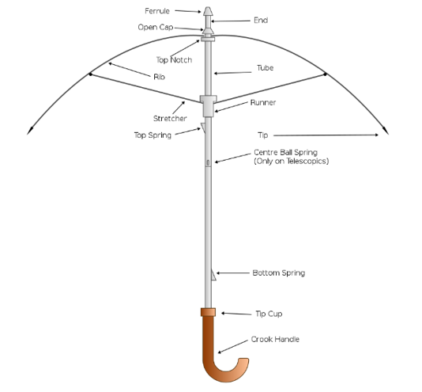
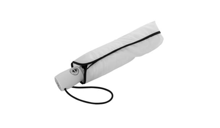

<html lang="en">
<head>
    <meta charset="UTF-8">
    <meta name="viewport" content="width=device-width, initial-scale=1.0">
    <title>TimeBrella</title>
    
</head>
<body>
    <header>
        <h1>TimeBrella</h1>
    </header>
    <nav class="nav-links">
        <a href="#concept">Concept</a> |
        <a href="#umbrella-info">Umbrella Information</a> |
        <a href="#timebrella-info">TimeBrella Information</a> |
        <a href="#how-to">How to Use & Build</a> |
        <a href="#contact">Contact</a>
    </nav>
    

    <section id="concept" class="content-section">
        <h2 id="concept-heading">Concept</h2>
        
"The TimeBrella" pushes the boundaries of our understanding of time by offering an invention as fascinating as it is intriguing.

        
This innovative device combines cutting-edge technology with the human dream of controlling time. Imagine a world where you can interact with time intuitively, where every moment can be savored, adjusted, or accelerated according to your desires.

        
With "The TimeBrella," the idea of a pause in the constant flow of life becomes a reality, offering a unique experience that combines practicality with wonder. It's a concept that inspires imagination while exploring the audacious notion that time can truly become an extension of yourself.

        
Beyond the captivating concept, "The TimeBrella" introduces a range of practical benefits to everyday life. It empowers individuals to make the most of their time, granting them the ability to pause and reflect during crucial moments, correct mistakes, or fast-track through mundane tasks.

        
This newfound control over time not only enhances productivity but also fosters a greater appreciation for life's fleeting moments. "The TimeBrella" aims to transform ordinary situations into extraordinary experiences, sparking curiosity and wonder in the hearts and minds of those who dare to wield its power.

    </section>
    

    <section id="umbrella-info" class="content-section">
        <h2 id="umbrella-info-heading">Umbrella Information</h2>
        <h3 id="etymology">Etymology</h3>
        
The word parasol (originally from French) is a combination of para, meaning 'to shield from' derived from the Latin parare, and sol, meaning 'sun'.

        
Parapluie (French) similarly consists of para combined with pluie, which means 'rain' (which in turn derives from pluvia, the Latin word for rain). Hence, a parasol shields from sunlight while a parapluie shields from rain.

        
The word umbrella evolved from the Latin umbra, meaning 'shaded' or 'shadow'. The Oxford English Dictionary records this as happening in the 17th century, with the first recorded usage in 1610.

        <h3 id="definition">Definition</h3>
        
An umbrella or a parasol is a folding canopy supported by wooden or metal ribs that is usually mounted on a wooden, metal, or plastic pole. It is designed to protect a person against rain. The term umbrella is traditionally used when protecting oneself from rain, with parasol used when protecting oneself from sunlight, though the terms continue to be used interchangeably.

        
Often the difference is the material used for the canopy; some parasols are not waterproof, and some umbrellas are transparent. Umbrella canopies may be made of fabric or flexible plastic. There are also combinations of parasol and umbrella that are called en-tout-cas (French for "in any case").

        <h3 id="some-videos">Some Videos</h3>
        

            

                
<strong>Peaceful</strong>

                

                    <iframe src="https://player.vimeo.com/video/440547496" allow="autoplay; fullscreen; picture-in-picture" allowfullscreen></iframe>
                

                

            

            

                
<strong>Nice</strong>

                

                    <iframe src="https://player.vimeo.com/video/397905855" allow="autoplay; fullscreen; picture-in-picture" allowfullscreen></iframe>
                

                

            

        

        <h3 id="parts-of-an-umbrella">Parts of an Umbrella</h3>
        
        
Fig.1 - That's an umbrella

        
More information on <a href="https://fr.wikipedia.org/wiki/Bip_Bip" target="_blank">Wikipedia</a>, and watch a short video clip for something completely unrelated: <a href="https://www.youtube.com/watch?v=CvBfHwUxHIk" target="_blank">https://www.youtube.com/watch?v=CvBfHwUxHIk</a>

    </section>
    

    <section id="timebrella-info" class="content-section">
        <h2 id="timebrella-info-heading">TimeBrella Information</h2>
        <h3 id="key-features">Key Features</h3>
        <ul>
            <li><strong>Time Freeze</strong> : With a simple turn of the handle, "The TimeBrella" can pause time, allowing you to savor a moment, make a decision, or simply take a break from the rush of life.</li>
            <li><strong>Temporal Rewind</strong> : Made a mistake or wish to redo a moment? "The TimeBrella" can rewind time, giving you a second chance to make things right.</li>
            <li><strong>Temporal Fast-Forward</strong> : Need to speed through a long queue or fast-track a task? "The TimeBrella" can accelerate time, making tedious moments a breeze.</li>
            <li><strong>Party Mode</strong> : To add a touch of excitement to any occasion, "The TimeBrella" features a Party Mode that intensifies music, laughter, and dancing, turning gatherings into memorable events.</li>
            <li><strong>Portable Design</strong> : "The TimeBrella" is designed for convenience, featuring a lightweight, compact build that you can carry anywhere.</li>
        </ul>
        <h4>Table 1: Features overview</h4>
        <table>
            <thead>
                <tr>
                    <th>Feature</th>
                    <th>Description</th>
                    <th>Image</th>
                    <th>Benefits</th>
                    <th>Time settings</th>
                </tr>
            </thead>
            <tbody>
                <tr>
                    <td>Time Freeze</td>
                    <td>"Pause time effortlessly with a twist of the handle, allowing for reflection and decision-making."</td>
                    <td></td>
                    <td>Enhanced productivity and stress reduction.</td>
                    <td>Customizable</td>
                </tr>
                <tr>
                    <td>Temporal Rewind</td>
                    <td>"Correct mistakes by rewinding time, giving you a second chance to make things right."</td>
                    <td></td>
                    <td>Improved decision-making and learning from experiences.</td>
                    <td>Customizable</td>
                </tr>
                <tr>
                    <td>Temporal Fast-Forward</td>
                    <td>"Accelerate time to breeze through queues and tedious tasks, making the most of your day."</td>
                    <td></td>
                    <td>Increased efficiency and more leisure time.</td>
                    <td>Customizable</td>
                </tr>
                <tr>
                    <td>Party Mode</td>
                    <td>"Transform gatherings into unforgettable parties with intensified music, laughter, and dancing."</td>
                    <td></td>
                    <td>Social interaction and creating memorable moments.</td>
                    <td>On/Off toggle</td>
                </tr>
                <tr>
                    <td>Portable Design</td>
                    <td>"Lightweight and compact, ""The TimeBrella"" is designed for easy transport, enabling time control anywhere."</td>
                    <td></td>
                    <td>Convenience and on-the-go time manipulation.</td>
                    <td>N/A</td>
                </tr>
            </tbody>
        </table>
    </section>
    

    <section id="how-to" class="content-section">
        <h2 id="how-to-heading">How to</h2>
        <h3 id="use">Use</h3>
        <ol>
            <li><strong>Unfold and Prepare:</strong> Start by unfolding "The TimeBrella" and ensuring it's fully charged. The device should be lightweight and easy to carry with you wherever you go.</li>
            <li><strong>Hold Firmly:</strong> Grip the ergonomic handle of "The TimeBrella" firmly. This handle serves as your control center for time manipulation.</li>
            <li><strong>Activate Time Freeze:</strong> To pause time and freeze the world around you, simply turn the handle counterclockwise until you hear a soft click. You'll notice everything coming to a standstill.</li>
            <li><strong>Adjust Duration:</strong> Use the time dial on the handle to adjust the duration of the time freeze. Turn it to the left for shorter pauses and to the right for longer ones. This customization allows you to control the extent of your time manipulation.</li>
            <li><strong>Temporal Rewind:</strong> If you need to correct a mistake or relive a moment, turn the handle clockwise until you feel a slight resistance. The world will start rewinding, and you can stop at the desired point.</li>
            <li><strong>Temporal Fast-Forward:</strong> For tasks or queues, turn the handle clockwise past the resistance point to accelerate time. Watch as time speeds up around you, making waiting a breeze.</li>
            <li><strong>Engage Party Mode:</strong> For a fun and lively atmosphere, press the Party Mode button located on the handle. This will intensify music, laughter, and energy, turning any gathering into an unforgettable party.</li>
            <li><strong>Capture Time:</strong> "The TimeBrella" features a built-in camera. To capture a time-frozen scene, press the capture button located on the handle. The image or video will be stored for future viewing.</li>
            <li><strong>Share Time:</strong> Connect with friends who also own "The TimeBrella" and share your time-frozen moments with them. This feature allows for unique shared experiences.</li>
            <li><strong>Exit Time Manipulation:</strong> To return to real-time, turn the handle clockwise to its original position. Time will resume its normal flow, and you can continue with your day.</li>
        </ol>
        <h3 id="build">Build</h3>
        <ol>
            <li><strong>Gather Materials:</strong> Assemble the necessary materials, including lightweight but durable materials for the umbrella structure, advanced electronics components, and a rechargeable power source.</li>
            <li><strong>Design the Frame:</strong> Create a lightweight yet sturdy frame for the umbrella. Consider a combination of lightweight metals and reinforced plastics to achieve the desired balance of portability and strength.</li>
            <li><strong>Install Time Control Module:</strong> Develop a compact time control module that can fit within the handle of the umbrella. This module will house the time manipulation technology and controls.</li>
            <li><strong>Develop Time Manipulation Algorithms:</strong> Design and program algorithms that control time manipulation functions such as time freeze, rewind, fast-forward, and party mode. These algorithms should be user-friendly and customizable.</li>
            <li><strong>Incorporate Power Source:</strong> Integrate a rechargeable power source into the handle, ensuring it provides sufficient energy for prolonged time manipulation.</li>
            <li><strong>Create User Interface:</strong> Design an intuitive user interface on the handle that includes a time dial, buttons for different time manipulation modes, and a capture button for the built-in camera.</li>
            <li><strong>Assemble the Umbrella:</strong> Attach the frame to the umbrella fabric, ensuring that the design is both functional and aesthetically pleasing. The fabric should also be weather-resistant for real-world use.</li>
            <li><strong>Integrate Camera:</strong> Embed a high-quality camera into the top of the umbrella, complete with a lens cover and a capture button on the handle for easy photography.</li>
            <li><strong>Test and Debug:</strong> Thoroughly test "The TimeBrella" prototype, ensuring that all time manipulation functions work as intended and that the device operates safely.</li>
            <li><strong>User Manual:</strong> Create a comprehensive user manual that provides instructions on how to use "The TimeBrella" effectively and safely.</li>
            <li><strong>Manufacturing and Distribution:</strong> Once the prototype is perfected, prepare for mass manufacturing and distribution to make "The TimeBrella" available to the public.</li>
        </ol>
    </section>
    

    <section id="contact" class="content-section">
        <h2 id="contact-heading">Contact</h2>
        <form action="/submit-contact" method="post">  
            <fieldset>
                <legend>Info</legend>
                

                    <label for="first-name">First name:</label>
                    <input type="text" id="first-name" name="first_name" placeholder="first name">
                

                

                    <label for="last-name">Last name:</label>
                    <input type="text" id="last-name" name="last_name" placeholder="last name">
                

                

                    <label for="email">Email:</label>
                    <input type="email" id="email" name="email" placeholder="xxxx@xxx.xx">
                

                

                    <label>I want a TimeBrella:</label>
                    

                        <input type="radio" id="want-yes" name="want_timebrella" value="Yes">
                        <label for="want-yes">Yes</label>
                        <input type="radio" id="want-no" name="want_timebrella" value="No">
                        <label for="want-no">No</label>
                    

                

            </fieldset>
            <fieldset>
                <legend>Message data</legend>   
                

                    <label for="topic">Topic:</label>
                    <select id="topic" name="topic">
                        <option value="where_to_buy">Where to buy?</option>
                        <option value="is_it_working">is it working?</option>
                        <option value="custom_design">Custom design inquiries</option>
                        <option value="other">Other</option>
                    </select>
                

                

                    <textarea name="message" rows="5" placeholder="Your message..."></textarea>
                

            </fieldset>
            

                <label for="newsletter" style="min-width: initial;">Receive newsletters:</label>
                <input type="checkbox" id="newsletter" name="newsletter" value="yes">
            

            

                <button type="submit">Submit</button>
                <button type="reset">Reset</button>
            

        </form>
    </section>
    

    <footer>
        
Created with WikiPedia and ChatGTP 3.5.

    </footer>

</body>
</html>
